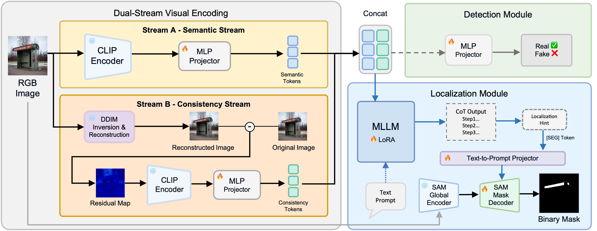
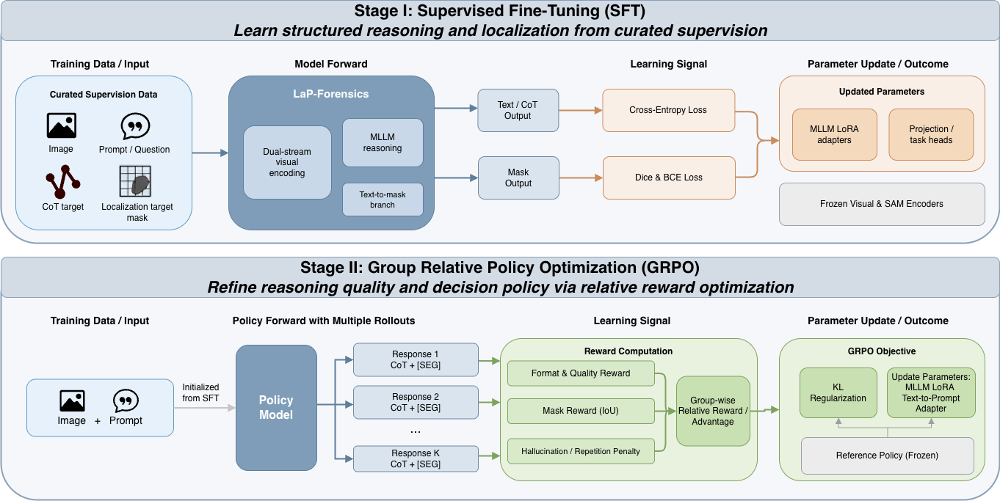

<div align="center">

# LaP-Forensics: Latent-Pixel Consistency Guided Multimodal Reasoning for Deepfake Detection 🔍

[](https://arxiv.org/abs/2607.25962)

</div>

LaP-Forensics is an explainable deepfake forensics framework built around two ideas:

- A **dual-stream representation** that fuses RGB semantics with a DDIM-derived **Latent-Pixel Consistency Map**
- A structured **Where-What-Why** reasoning pipeline aligned with segmentation quality and evidence consistency

## What's New 🆕

- **2026-08-31** — Code released ✅
- **2026-07-28** — arXiv preprint available: [arXiv:2607.25962](https://arxiv.org/abs/2607.25962)
- **2026-07-27** — Accepted by ACM Multimedia 2026 🎉

## Method Overview 🏗️

<p align="center">
  
</p>

LaP-Forensics combines a semantic RGB stream with a latent-pixel consistency stream, then routes the fused representation into both authenticity detection and grounded localization/explanation heads.

## Highlights ✨

- **Grounded reasoning**: explanations are tied to pixel-space forensic evidence instead of surface-level visual guesses
- **Dual-stream modeling**: RGB features are complemented by diffusion reconstruction residuals
- **Unified forensics pipeline**: image-level authenticity classification, region localization, and textual explanation
- **RL alignment**: GRPO is used to penalize hallucinated reasoning and improve evidence fidelity

## Repository Layout 🧭

```text
LaP-Forensics/
├── assets/
│   └── figures/         # Paper figures used in the public README
├── configs/              # RL and DeepSpeed configs
├── dataset/              # Dataset wrappers and task-specific loaders
├── docs/                 # Architecture notes
├── eval/                 # Inference/evaluation helpers
├── model/                # LaP model implementation
├── requirements.txt      # Python dependencies
├── rl/                   # GRPO dataset wrapper, trainer, rewards
├── scripts/
│   ├── cls/              # Image-level detection train/eval entrypoints
│   ├── loc_exp/          # Localization / explanation train, eval, inference
│   ├── merge_weights/    # LoRA checkpoint conversion + merge helpers
│   └── rl/               # GRPO training and checkpoint merge helpers
├── tools/                # Shared utilities
└── prepare_cls_dataset.py
```

## Installation ⚙️

This repo no longer vendors `mmcv`. Install it externally.

```bash
conda create -n lap-forensic python=3.10 -y
conda activate lap-forensic

pip install -r requirements.txt

# External MMCV dependency required by the kept model code
pip install -U openmim
mim install "mmcv-full==1.4.7"
```

## Expected Checkpoints 📦

Create a local `checkpoints/` directory and place the required weights there, or point the shell scripts to your own paths with environment variables.

- `BASE_MODEL_PATH`: SFT initialization checkpoint compatible with `LaPForCausalLM`
- `SAM_CKPT`: Segment Anything checkpoint, for example `./checkpoints/sam_vit_h_4b8939.pth`
- `MODEL_PATH` / `CHECKPOINT_PATH`: merged or training checkpoints produced by this repo

Most scripts default to repo-relative paths such as `./checkpoints/...` and `./data/...`.

Download the official SAM ViT-H checkpoint here: [sam_vit_h_4b8939.pth](https://dl.fbaipublicfiles.com/segment_anything/sam_vit_h_4b8939.pth).

## Data Layout 🗂️

The cleaned repo assumes repo-relative datasets by default:

```text
data/
├── SynthScars/
│   ├── train/
│   └── test/
└── SynthScars_CoT/
    ├── train/
    └── test/
```

Adjust paths with environment variables if your datasets live elsewhere.

## Main Workflows 🚀

<p align="center">
  
</p>

The released workflow follows the same two-stage recipe described in the paper: supervised fine-tuning for structured reasoning and mask grounding, followed by GRPO alignment for response quality and evidence consistency.

### 1. Supervised Fine-Tuning

```bash
BASE_MODEL_PATH=./checkpoints/base_model \
SAM_CKPT=./checkpoints/sam_vit_h_4b8939.pth \
DATASET_DIR=./data/SynthScars_CoT \
bash scripts/loc_exp/train.sh
```

### 2. Merge LoRA Weights

```bash
CHECKPOINT_ROOT=./runs/sft/lap_forensic_sft/ckpt_model_ce_1.0_dice_1.0_bce_1.0 \
CHECKPOINT_TAG=global_step0000 \
bash scripts/merge_weights/step1.sh

BASE_MODEL_PATH=./checkpoints/base_model \
SAM_CKPT=./checkpoints/sam_vit_h_4b8939.pth \
CHECKPOINT_ROOT=./runs/sft/lap_forensic_sft/ckpt_model_ce_1.0_dice_1.0_bce_1.0 \
CHECKPOINT_TAG=global_step0000 \
MERGED_MODEL_PATH=./checkpoints/lap_forensic_merged \
bash scripts/merge_weights/step2.sh
```

### 3. Artifact Localization and Explanation Inference

```bash
MODEL_PATH=./checkpoints/lap_forensic_merged \
IMAGE_DIR=./inference_data \
OUTPUT_DIR=./results/inference \
bash scripts/loc_exp/infer.sh
```

### 4. Image-Level Detection

```bash
MODEL_PATH=./checkpoints/lap_forensic_merged \
SAM_CKPT=./checkpoints/sam_vit_h_4b8939.pth \
TRAIN_JSON=./data/detection/train.json \
TEST_JSON=./data/detection/test.json \
TRAIN_IMAGE_ROOT=./data/detection/train/images \
TEST_IMAGE_ROOT=./data/detection/test/images \
bash scripts/cls/train.sh
```

```bash
MODEL_PATH=./checkpoints/lap_cls_train \
SAM_CKPT=./checkpoints/sam_vit_h_4b8939.pth \
TEST_JSON=./data/detection/test.json \
TEST_IMAGE_ROOT=./data/detection/test/images \
bash scripts/cls/eval.sh
```

### 5. GRPO Alignment

Edit `configs/rl_config.yaml` if needed, then run:

```bash
MODEL_PATH=./checkpoints/lap_forensic_merged \
SAM_CKPT=./checkpoints/sam_vit_h_4b8939.pth \
bash scripts/rl/train_grpo.sh
```

To merge a GRPO checkpoint:

```bash
BASE_MODEL_PATH=./checkpoints/lap_forensic_merged \
SAM_CKPT=./checkpoints/sam_vit_h_4b8939.pth \
bash scripts/rl/merge_grpo_checkpoint.sh ./runs/grpo/<run>/checkpoint-100
```

## Notes 📝

- The repo intentionally excludes experimental utilities, visualization scratch scripts, vendored `mmcv`, and local training artifacts.

## License 📄

The source code in this repository is released under the [Apache License 2.0](./LICENSE). Datasets, model weights, figures, and third-party dependencies may be subject to separate terms.

## Citation 📚

If you use this repository, please cite:

```bibtex
@article{wang2026lapforensics,
  title={LaP-Forensics: Latent-Pixel Consistency Guided Multimodal Reasoning for Deepfake Detection},
  author={Can Wang and Yuhao Wang and Yushe Cao and Canran Xiao and Fei Shen},
  journal={arXiv preprint arXiv:2607.25962},
  year={2026},
  url={https://arxiv.org/abs/2607.25962}
}
```
